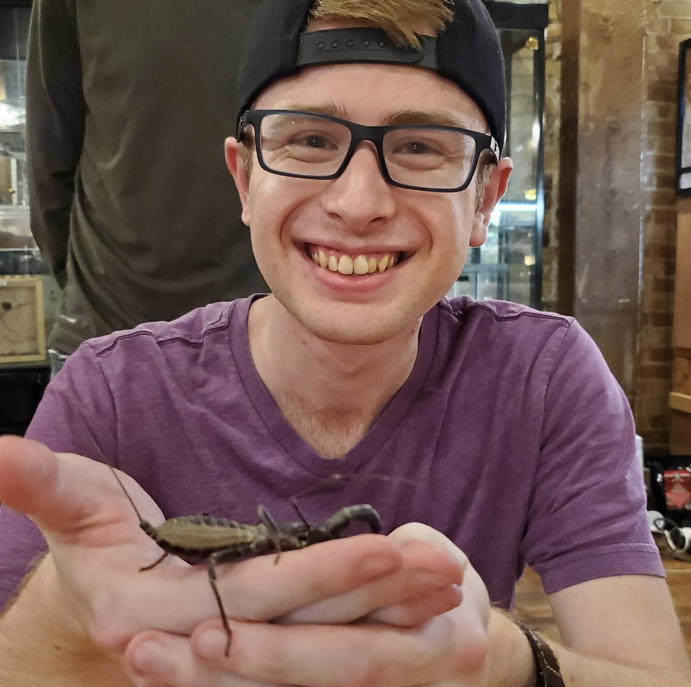

## About Me
I am a MS student in the UConn EEB department interested in Bryophyte Systematics and Evolution
[My CV](PDFs/BrendenThomsonCV.pdf)

## Publications
Henrie, J.R.; Thomson, B.M.; Yungfleisch, A.A.; Kerr, M.; Leavitt, S.D. Characterizing 
  Crustose Lichen Communities—DNA Metabarcoding Reveals More than Meets the Eye. 
  Diversity 2022, 14, 766. <https://doi.org/10.3390/d14090766>

[Contact Info](contact-info.html)

